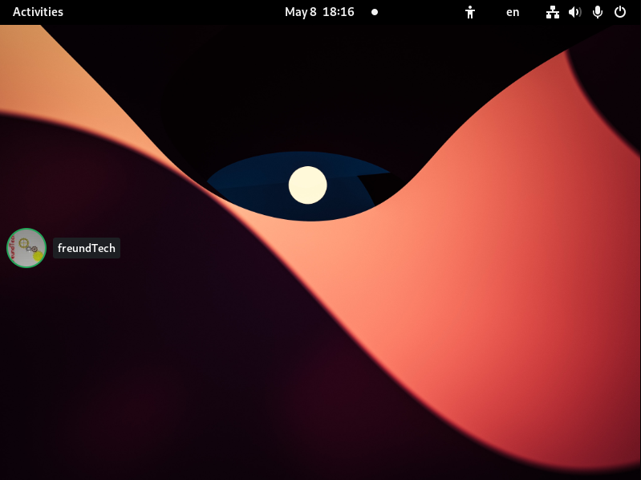

Overlay for Discord
===================

Overlay for Discord is a Gnome Extension that adds a voice overlay
for the popular voice messaging platform Discord to your desktop.

It also adds a global mute shortcut :wink:

Overlay for Discord is not affiliated or endorsed by Discord Inc. All trademarks, including the "Discord" word mark are owned by their respective owners and are used nominatively.

Status
------

Overlay for Discord is still work in progress. While the main functionality is working there might still be some bugs.
Some features, such as changing the location of the overlay are also still missing.

FAQ
---
* Why a Gnome extension?
  * Wayland makes it very hard or impossible to implement overlays as normal applications, as applications don't have control over where they are placed. If you don't use wayland you can also have a look at [Discover](https://github.com/trigg/Discover).
* Why Discord instead of a free alternative?
  * Because most of the people I play games with are on Discord. However, I tried to keep the code as chat-platform independent as possible, so it shouldn't be too hard to add support for other platforms.
* Why is this not on [extensions.gnome.org](https://extensions.gnome.org/)?
  * Because I want to get it into a more complete state and clean up the code a bit before submitting it.
* Can I help?
  * Yes. But please open an issue first, so we don't work on the same thing at the same time.
